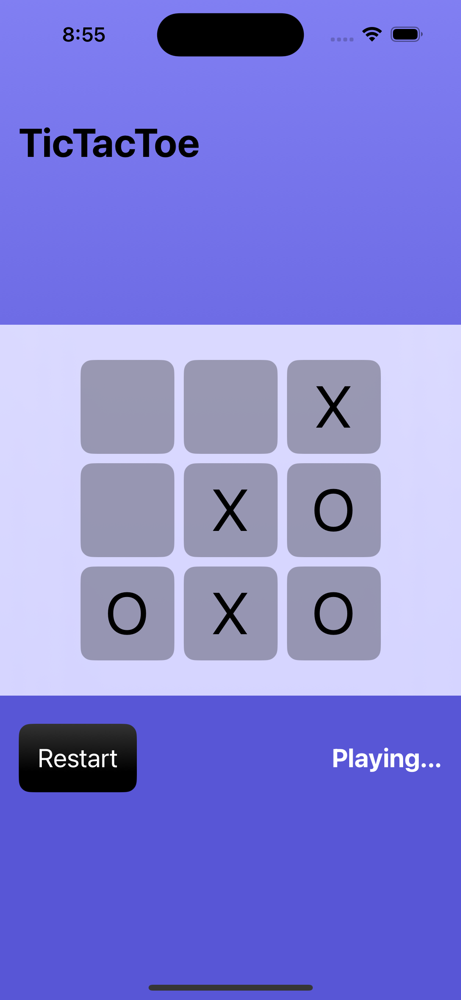
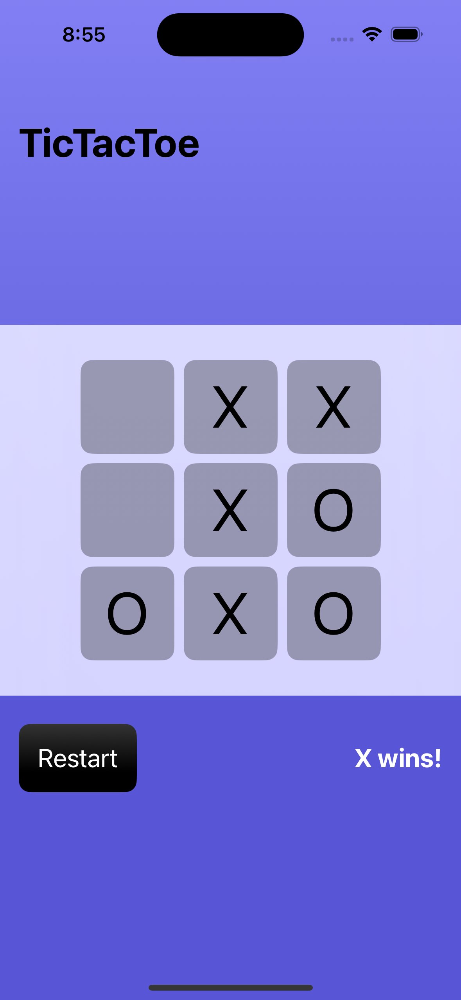
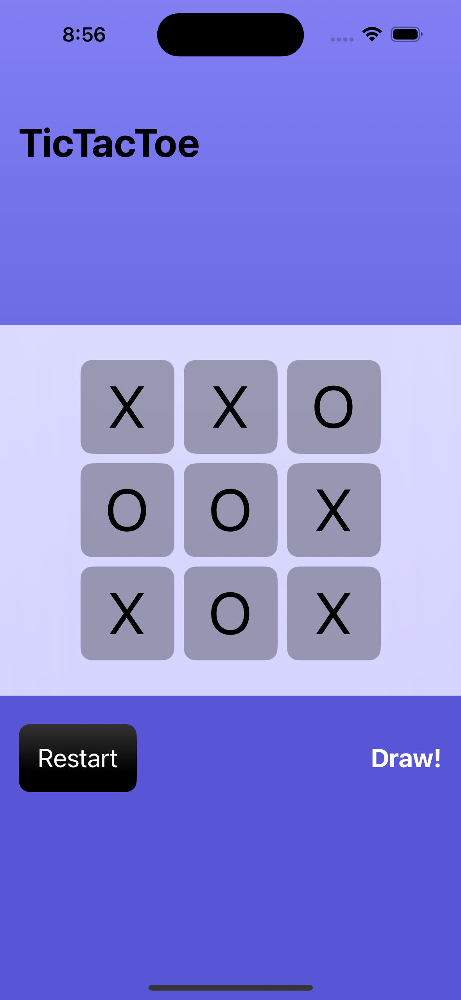

# TicTacToe (SwiftUI)

A polished TicTacToe game for iOS, built entirely with SwiftUI.  
Features real-time **win/draw detection**, a **restart function**, and a clean, responsive interface.

---

## 📸 Screenshots

  
  
  

---

## ✨ Key Features
- **SwiftUI-based UI** with modern styling
- **Restart** button to reset the game instantly
- **Win detection** for rows, columns, and diagonals
- **Draw detection** when the board is full
- Reusable **UI modifiers** for consistent design

## ▶️ How to Run
1. Open the project in **Xcode 15** or newer.
2. Select an iOS Simulator (e.g., iPhone 15).
3. Press **Run** ▶️ to start the game.

## 🖼️ How to Capture Screenshots

### 1) Playing — `playing.png`
Play until both **X** and **O** are visible, then take a screenshot.

### 2) Win — `win.png`
Quick win for **X**:
1. (0,0) → X  
2. (1,0) → O  
3. (0,1) → X  
4. (1,1) → O  
5. (0,2) → X ✅ *X wins (top row)*

### 3) Draw — `draw.png`
Fill the board without a winner:
1. (0,0) X  
2. (1,1) O  
3. (0,1) X  
4. (0,2) O  
5. (2,0) X  
6. (1,0) O  
7. (1,2) X  
8. (2,1) O  
9. (2,2) X ✅ *Draw*

> Use the **Restart** button to reset the board anytime.

## 🛠 Code Overview
The game logic is handled in `ContentView.swift`:
- `board: [[Player]]` — current state of the game board
- `currentPlayer` — active player
- `makeMove(row:col:)` — handles moves and turn switching
- `checkWinner(player:)` — determines the winner
- `isDraw()` — checks for a draw
- `resetBoard()` — resets the game state

### UI Modifiers
- **Cell** — style for game board cells
- **RestartButton** — style for the restart button
- **StatusText** — style for the game status label

## 📜 License
MIT License — free to use, modify, and share.
